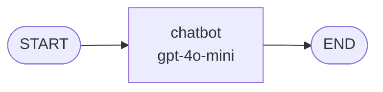
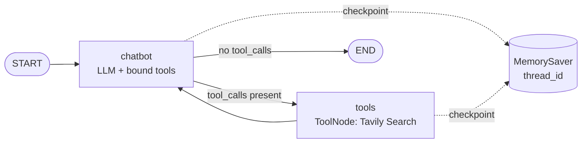
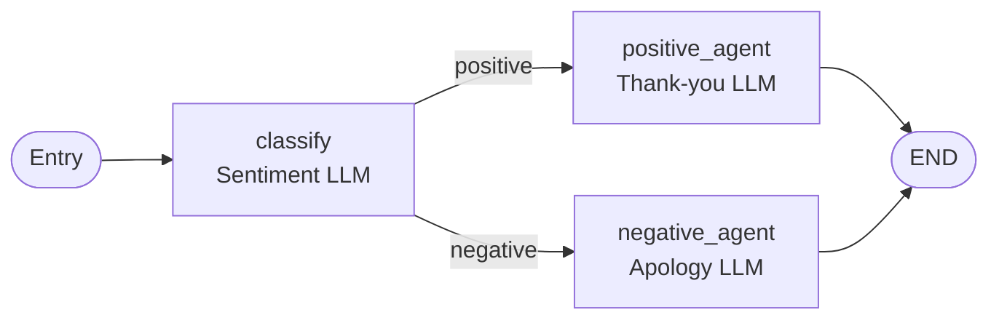
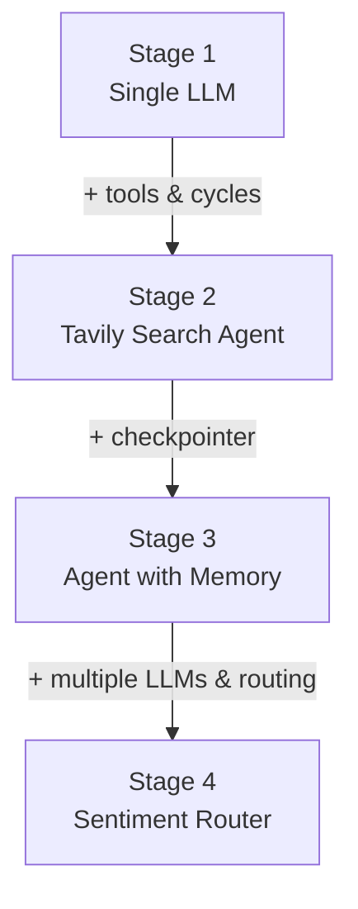

# 🔗 LangGraph Agent — Stateful AI Workflows with Memory & Tool Use

Build stateful, multi-actor AI agents using **LangGraph** — progressing from a simple single-LLM chatbot to a tool-enabled agent with persistent memory, all the way to a multi-agent sentiment routing system.


---

## 📌 Table of Contents

* [What is this project?](https://github.com/shivaniharane/LangGraph_Agent/tree/main#-what-is-this-project)
* [Why LangGraph?](https://github.com/shivaniharane/LangGraph_Agent/tree/main#-why-langgraph)
* [Core Concepts](https://github.com/shivaniharane/LangGraph_Agent/tree/main#-core-concepts)
* [Project Stages Overview](https://github.com/shivaniharane/LangGraph_Agent/tree/main#-project-stages-overview)
* [Flowcharts](https://github.com/shivaniharane/LangGraph_Agent/tree/main#-flowcharts)
* [Project Structure](https://github.com/shivaniharane/LangGraph_Agent/tree/main#-project-structure)
* [Tech Stack & Tools](https://github.com/shivaniharane/LangGraph_Agent/tree/main#-tech-stack--tools)
* [Stage 1: Single LLM Agent](https://github.com/shivaniharane/LangGraph_Agent/tree/main#-stage-1-single-llm-agent)
* [Stage 2: Agent with Tools (Tavily Search)](https://github.com/shivaniharane/LangGraph_Agent/tree/main#-stage-2-agent-with-tools-tavily-search)
* [Stage 3: Agent with Persistent Memory](https://github.com/shivaniharane/LangGraph_Agent/tree/main#-stage-3-agent-with-persistent-memory)
* [Stage 4: Multi-LLM Agent — Sentiment Router](https://github.com/shivaniharane/LangGraph_Agent/tree/main#-stage-4-multi-llm-agent--sentiment-router)
* [Setup & Installation](https://github.com/shivaniharane/LangGraph_Agent/tree/main#-setup--installation)
* [Running on Google Colab](https://github.com/shivaniharane/LangGraph_Agent/tree/main#-running-on-google-colab)
* [API Keys Required](https://github.com/shivaniharane/LangGraph_Agent/tree/main#-api-keys-required)
* [Sample Outputs](https://github.com/shivaniharane/LangGraph_Agent/tree/main#-sample-outputs)
* [Limitations](https://github.com/shivaniharane/LangGraph_Agent/tree/main#-limitations)
* [How Limitations Can Be Resolved](https://github.com/shivaniharane/LangGraph_Agent/tree/main#-how-limitations-can-be-resolved)
* [Key Concepts for Beginners](https://github.com/shivaniharane/LangGraph_Agent/tree/main#-key-concepts-for-beginners)
* [LangGraph vs Other Frameworks](https://github.com/shivaniharane/LangGraph_Agent/tree/main#-langgraph-vs-other-frameworks)
* [Contributing](https://github.com/shivaniharane/LangGraph_Agent/tree/main#-contributing)

---

## 🎯 What is this project?

This repository is a hands-on, notebook-based walkthrough of **LangGraph**, a library from the LangChain ecosystem for building **stateful, multi-actor applications with LLMs**.

Instead of jumping straight into a complex agent, the notebook builds up in four incremental stages. Each stage adds exactly one new capability on top of the previous one, so you can see how the graph changes and why:

1. A plain chatbot powered by a single LLM node.
2. The same chatbot, now able to call a **web search tool** (Tavily) and loop back with the results.
3. The tool-enabled agent, now with **conversation memory** scoped per user thread.
4. A **multi-LLM workflow** where one LLM classifies customer feedback and conditionally routes it to a specialised "positive" or "negative" response agent.

By the end, you'll understand the building blocks — **State, Nodes, Edges, Conditional Edges, ToolNode, and Checkpointers** — that underpin almost every production LangGraph agent.

---

## 💡 Why LangGraph?

LangGraph offers three core benefits over many other LLM frameworks:

| Benefit | What it means | Why it matters for agents |
|---|---|---|
| 🔁 **Cycles** | Flows can loop (e.g. LLM → Tool → LLM → Tool …) | Most agentic behaviour is iterative. DAG-only frameworks can't express "keep going until done". |
| 🎛️ **Controllability** | Low-level control over both the flow and the state | You decide exactly which node runs next and what data it sees — essential for reliable agents. |
| 💾 **Persistence** | Built-in checkpointing of graph state | Enables memory across turns, human-in-the-loop approvals, and resuming interrupted runs. |

> *Source: LangGraph GitHub*

---

## 🧠 Core Concepts

| Concept | Description | Used in notebook as |
|---|---|---|
| **State** | A typed dictionary shared by every node. Nodes read from it and return updates to it. | `class State(TypedDict): messages: Annotated[list, add_messages]` |
| **Reducer (`add_messages`)** | Tells LangGraph *how* to merge updates — here, append new messages instead of overwriting. | `Annotated[list, add_messages]` |
| **StateGraph** | The builder object that describes your agent as a state machine. | `graph_builder = StateGraph(State)` |
| **Node** | A Python function (or runnable) that takes the State and returns a partial update. | `chatbot`, `tools`, `classify`, `positive_agent`, `negative_agent` |
| **Edge** | A fixed transition from one node to another. | `add_edge(START, "chatbot")` |
| **Conditional Edge** | A transition decided at runtime by a routing function. | `tools_condition`, `lambda x: x["sentiment"]` |
| **START / END** | Special entry and exit points of the graph. | `START`, `END` |
| **ToolNode** | Prebuilt node that executes tool calls found in the last AI message (in parallel if several). | `ToolNode(tools=[tool])` |
| **Checkpointer** | Saves state after every step, keyed by `thread_id`. | `MemorySaver()` |
| **Compile** | Turns the builder into a runnable `CompiledGraph`. | `graph_builder.compile(checkpointer=memory)` |

---

## 🗺️ Project Stages Overview

| Stage | Name | New concept introduced | Nodes | LLM |
|---|---|---|---|---|
| 1 | Single LLM Agent | State, nodes, edges, compile, stream | `chatbot` | `gpt-4o-mini` |
| 2 | Agent with Tools | `bind_tools`, `ToolNode`, `tools_condition`, cycles | `chatbot`, `tools` | `gpt-4o-mini` |
| 3 | Agent with Memory | `MemorySaver`, `thread_id`, `get_state` snapshots | `chatbot`, `tools` | `gpt-4o-mini` |
| 4 | Multi-LLM Sentiment Router | Custom state schema, prompt chains, conditional routing to multiple agents | `classify`, `positive_agent`, `negative_agent` | `ChatOpenAI()` default |

---

## 📊 Flowcharts

### Stage 1 — Single LLM Agent



### Stage 2 & 3 — Tool-Enabled Agent (with optional memory)



### Stage 4 — Multi-LLM Sentiment Router



### Learning Progression



---

## 📁 Project Structure

```
LangGraph_Agent/
│
├── LangGraph_Agent.ipynb   # Main notebook — all four stages, end to end
└── README.md               # You are here
```

The notebook is organised into these sections:

```
LangGraph_Agent.ipynb
├── Intro: What is LangGraph?
├── Installation & API key setup
├── Single LLM Agent
├── Adding tools to this Simple Agent (Tavily)
├── Add memory to the Agent
│   ├── What would happen if I change my config
│   └── Snapshot of current state
└── Multi LLM Agent Flow (Sentiment Router)
```

---

## 🛠️ Tech Stack & Tools

| Tool / Library | Purpose |
|---|---|
| **Python 3.10+** | Language |
| **LangGraph** | Graph-based orchestration of agent state and flow |
| **LangChain Core** | `PromptTemplate`, runnables, message types |
| **langchain-openai** | `ChatOpenAI` wrapper for OpenAI chat models |
| **OpenAI `gpt-4o-mini`** | Reasoning / chat LLM |
| **Tavily** (`tavily-python`, `langchain-community`) | Web search tool for real-time information |
| **MemorySaver** | In-memory checkpointer for conversation persistence |
| **IPython.display + Mermaid** | Rendering the graph as an image |
| **Google Colab** | Notebook runtime and secret management (`userdata`) |

---

## 🤖 Stage 1: Single LLM Agent

The simplest possible LangGraph app: one node that calls the LLM.

```python
from typing import Annotated
from typing_extensions import TypedDict
from langgraph.graph import StateGraph, START, END
from langgraph.graph.message import add_messages
from langchain_openai import ChatOpenAI

class State(TypedDict):
    messages: Annotated[list, add_messages]

graph_builder = StateGraph(State)
llm = ChatOpenAI(model="gpt-4o-mini")

def chatbot(state: State):
    return {"messages": [llm.invoke(state["messages"])]}

graph_builder.add_node("chatbot", chatbot)
graph_builder.add_edge(START, "chatbot")
graph_builder.add_edge("chatbot", END)

graph = graph_builder.compile()
```

**Key takeaway:** every node receives the current `State` and returns a dictionary with an update. Because of the `add_messages` reducer, the LLM's reply is *appended* to the message list rather than replacing it.

---

## 🔍 Stage 2: Agent with Tools (Tavily Search)

The agent is given a web search tool. The LLM decides whether to call it; if it does, the graph routes to a `ToolNode`, runs the search, and **loops back** to the LLM with the results.

```python
from langchain_community.tools.tavily_search import TavilySearchResults
from langgraph.prebuilt import ToolNode, tools_condition

tool = TavilySearchResults(max_results=2)
tools = [tool]
llm_with_tools = ChatOpenAI(model="gpt-4o-mini").bind_tools(tools)

def chatbot(state: State):
    return {"messages": [llm_with_tools.invoke(state["messages"])]}

graph_builder.add_node("chatbot", chatbot)
graph_builder.add_node("tools", ToolNode(tools=[tool]))

graph_builder.add_conditional_edges("chatbot", tools_condition)  # -> "tools" or END
graph_builder.add_edge("tools", "chatbot")                      # the cycle
graph_builder.add_edge(START, "chatbot")

graph = graph_builder.compile()
```

| Component | Role |
|---|---|
| `bind_tools(tools)` | Tells the LLM which tools exist and their schemas |
| `ToolNode` | Executes every tool call in the last `AIMessage` and returns `ToolMessage`s |
| `tools_condition` | Routes to `"tools"` if the last message has tool calls, otherwise to `END` |
| `tools → chatbot` edge | Creates the **cycle** that makes this an agent rather than a pipeline |

---

## 💾 Stage 3: Agent with Persistent Memory

The same tool-enabled graph is compiled with a **checkpointer**. State is saved after every step and keyed by a `thread_id`, so the agent remembers earlier turns within the same thread.

```python
from langgraph.checkpoint.memory import MemorySaver

memory = MemorySaver()
graph = graph_builder.compile(checkpointer=memory)

config = {"configurable": {"thread_id": "User_1"}}
graph.stream({"messages": [("user", "Hi, my name is Ruturaj")]}, config, stream_mode="values")
graph.stream({"messages": [("user", "Do you know my name?")]}, config, stream_mode="values")
# -> "Yes, your name is Ruturaj."
```

**Thread isolation demo:** switching to `thread_id: "User_2"` and asking the same question returns *"No, I don't know your name"* — each thread has its own isolated memory.

**Inspecting state:** `graph.get_state(config)` returns a `StateSnapshot` containing all messages, token usage metadata, and the next node to run — useful for debugging and human-in-the-loop flows.

> ⚠️ `MemorySaver` keeps everything in RAM and is meant for experimentation. For production, use `SqliteSaver` or `PostgresSaver` backed by your own database.

---

## 🔀 Stage 4: Multi-LLM Agent — Sentiment Router

This stage moves away from chat messages to a **custom state schema** and chains several LLM calls, each with its own job.

```python
class AgentState(TypedDict):
    input: str
    output: str
    sentiment: str
```

| Node | LLM task | Output written to state |
|---|---|---|
| `classify` | "Classify this feedback as positive or negative" | `sentiment` |
| `positive_agent` | "Thank the customer for their positive feedback" | `output` |
| `negative_agent` | "Apologize and assure the issue will be addressed" | `output` |

```python
workflow = StateGraph(AgentState)
workflow.add_node("classify", classify_feedback)
workflow.add_node("positive_agent", handle_positive_feedback)
workflow.add_node("negative_agent", handle_negative_feedback)

workflow.add_conditional_edges(
    "classify",
    lambda x: x["sentiment"],
    {"positive": "positive_agent", "negative": "negative_agent"},
)

workflow.set_entry_point("classify")
workflow.add_edge("positive_agent", END)
workflow.add_edge("negative_agent", END)
sentiment_app = workflow.compile()
```

To run it:

```python
result = sentiment_app.invoke({"input": "I absolutely loved the service!"})
print(result["sentiment"], "->", result["output"].content)
```

**Key takeaway:** conditional edges can route to *any number* of specialised agents based on a value the previous node wrote into state — the foundation of supervisor and router architectures.

---

## ⚙️ Setup & Installation

### 1. Clone the repository

```bash
git clone https://github.com/shivaniharane/LangGraph_Agent.git
cd LangGraph_Agent
```

### 2. Create a virtual environment (recommended)

```bash
python -m venv venv
source venv/bin/activate        # Windows: venv\Scripts\activate
```

### 3. Install dependencies

```bash
pip install langgraph langchain_openai openai tavily-python langchain_community jupyter
```

### 4. Set your API keys

```bash
export OPENAI_API_KEY="sk-..."
export TAVILY_API_KEY="tvly-..."
```

### 5. Adjust the key-loading cell

The notebook uses Colab's `userdata`. When running locally, replace that cell with:

```python
import os
# Keys are read from the environment variables set above
assert os.getenv("OPENAI_API_KEY") and os.getenv("TAVILY_API_KEY")
```

### 6. Launch

```bash
jupyter notebook LangGraph_Agent.ipynb
```

---

## ☁️ Running on Google Colab

1. Open the notebook in Colab (**File → Open notebook → GitHub** and paste the repo URL).
2. Click the **🔑 Secrets** icon in the left sidebar.
3. Add two secrets and enable **Notebook access** for both:
   * `OPENAI_API_KEY`
   * `TAVILY_API_KEY`
4. Run all cells top to bottom (**Runtime → Run all**).

The notebook reads the keys with:

```python
from google.colab import userdata
os.environ['OPENAI_API_KEY'] = userdata.get('OPENAI_API_KEY')
os.environ['TAVILY_API_KEY'] = userdata.get('TAVILY_API_KEY')
```

---

## 🔑 API Keys Required

| Service | Environment variable | Where to get it | Used in |
|---|---|---|---|
| OpenAI | `OPENAI_API_KEY` | https://platform.openai.com/api-keys | All stages |
| Tavily | `TAVILY_API_KEY` | https://tavily.com/ | Stages 2 & 3 |

> 🔒 Never commit API keys to the repository. Use Colab Secrets, environment variables, or a `.env` file listed in `.gitignore`.

---

## 🧪 Sample Outputs

**Stage 1 — Single LLM**

```
User: What do you know about AI?
Assistant: Artificial Intelligence (AI) refers to the simulation of human intelligence
processes by machines, especially computer systems... 
  1. Types of AI: Narrow AI, General AI ...
```

**Stage 2 — Tavily tool test**

```python
tool.invoke("What is ML?")
# [{'title': 'Machine learning - Wikipedia',
#   'url': 'https://en.wikipedia.org/wiki/Machine_learning',
#   'content': 'Machine learning (ML) is a field of study in artificial intelligence...'}, ...]
```

**Stage 3 — Memory within a thread**

```
===== Human Message =====   (thread: User_1)
Hi, my name is Ruturaj
===== Ai Message =====
Hello Ruturaj! How can I assist you today?

===== Human Message =====   (thread: User_1)
Do you know my name?
===== Ai Message =====
Yes, your name is Ruturaj. How can I help you today?
```

**Stage 3 — Different thread, no shared memory**

```
===== Human Message =====   (thread: User_2)
Do you know my name?
===== Ai Message =====
No, I don't know your name. However, if you'd like to share it...
```

**Stage 4 — Feedback inputs tested**

| Feedback | Expected route |
|---|---|
| "I absolutely loved the service! The staff were friendly..." | `positive_agent` |
| "The service was slow, and the staff seemed disinterested..." | `negative_agent` |
| "My experience was frustrating. The website was hard to navigate..." | `negative_agent` |

---

## ⚠️ Limitations

1. **In-memory persistence only** — `MemorySaver` loses all conversation history when the kernel restarts and cannot be shared across processes or servers.
2. **Stage 4 test cell calls the wrong graph** — `workflow.compile()` is not assigned to a variable, and `get_feedback()` streams through `graph` (the Stage 3 memory agent). The printed responses therefore come from the general chatbot, not the sentiment router.
3. **Fragile sentiment routing** — the classifier returns free text. An answer like `"Positive."` or `"The sentiment is negative"` doesn't match the routing keys and raises an error. There is also no route for neutral or mixed feedback.
4. **Deprecated Tavily integration** — `TavilySearchResults` from `langchain_community` is deprecated, and `langchain-community` itself is being sunset.
5. **Tool use not demonstrated end to end** — the Stage 2 test question ("What do you know about AI?") is answerable from the model's own knowledge, so the LLM doesn't call Tavily and the tool loop isn't exercised.
6. **LLMs re-created on every call in Stage 4** — each node instantiates a new `ChatOpenAI()` with the default model, adding overhead and making the model choice implicit.
7. **Colab-specific setup** — `google.colab.userdata` fails outside Colab without edits.
8. **Unbounded context growth** — the message list keeps growing within a thread, increasing token cost and eventually hitting the context limit.
9. **No error handling** — API failures, rate limits, or empty search results aren't caught.

---

## ✅ How Limitations Can Be Resolved

| # | Limitation | Resolution |
|---|---|---|
| 1 | In-memory persistence | Use `SqliteSaver` (`langgraph-checkpoint-sqlite`) or `PostgresSaver` (`langgraph-checkpoint-postgres`) for durable, shareable memory. |
| 2 | Wrong graph in Stage 4 test | Assign `sentiment_app = workflow.compile()` and call `sentiment_app.invoke({"input": text})` inside the loop. |
| 3 | Fragile routing | Use structured output: `llm.with_structured_output(SentimentSchema)` with `Literal["positive", "negative", "neutral"]`, or normalise the text before routing; add a `neutral_agent` or a default fallback route. |
| 4 | Deprecated Tavily class | `pip install -U langchain-tavily` and use `from langchain_tavily import TavilySearch`. |
| 5 | Tool loop not exercised | Ask a time-sensitive question (e.g. "What are today's top AI news headlines?") and print each streamed step to see the `tools` node run. |
| 6 | LLMs re-created per call | Create each LLM once at module level with an explicit model name, e.g. `ChatOpenAI(model="gpt-4o-mini", temperature=0)`. |
| 7 | Colab-only key loading | Use `python-dotenv` with a `.env` file, falling back to `userdata` only when running in Colab. |
| 8 | Unbounded context | Trim or summarise history with `trim_messages` or a summarisation node before calling the LLM. |
| 9 | No error handling | Wrap LLM/tool calls in `try/except`, use LangChain's `.with_retry()`, and set `recursion_limit` in the run config. |

---

## 📚 Key Concepts for Beginners

**What is an "agent"?**
An LLM that can decide what to do next — answer directly, call a tool, or hand off to another step — instead of following a fixed script.

**What is "state"?**
The shared memory of a single run. Think of it as a dictionary every node can read and add to. In Stages 1–3 it holds the chat messages; in Stage 4 it holds `input`, `sentiment`, and `output`.

**Why do we need a reducer like `add_messages`?**
Without it, each node's returned `messages` would *overwrite* the previous list. The reducer appends instead, preserving conversation history.

**What's the difference between an edge and a conditional edge?**
A normal edge always goes to the same next node. A conditional edge runs a small function to pick the next node at runtime (e.g. "did the LLM ask for a tool?").

**What is a `thread_id`?**
A label for a conversation. The checkpointer saves state per thread, so `User_1` and `User_2` get independent memories.

**What does `stream_mode="values"` do?**
It yields the full state after each step, which is why the notebook prints `event["messages"][-1]` to show the latest message.

**What is a tool call?**
When the LLM returns a structured request like "call `tavily_search` with query X" instead of plain text. `ToolNode` executes it and feeds the result back.

---

## ⚖️ LangGraph vs Other Frameworks

| Feature | LangGraph | LangChain (LCEL chains) | CrewAI | AutoGen |
|---|---|---|---|---|
| Abstraction level | Low-level, explicit graph | Mid-level pipelines | High-level role-based crews | Conversation-driven agents |
| Cycles / loops | ✅ Native | ⚠️ Limited (mainly DAGs) | ✅ Via task delegation | ✅ Via agent chat |
| Explicit state control | ✅ Typed state + reducers | ⚠️ Passed between steps | ⚠️ Mostly implicit | ⚠️ Mostly implicit in messages |
| Built-in persistence | ✅ Checkpointers | ❌ | ⚠️ Memory modules | ⚠️ Varies |
| Human-in-the-loop | ✅ Interrupts on checkpoints | ❌ | ⚠️ Limited | ✅ Human proxy agent |
| Learning curve | Moderate | Low | Low | Moderate |
| Best for | Reliable, controllable production agents | Linear LLM pipelines, RAG | Quick multi-agent prototypes | Research and conversational multi-agent setups |

---

## 🤝 Contributing

Contributions are welcome! Some ideas:

* Fix the Stage 4 test cell and add structured sentiment output
* Migrate to `langchain-tavily`
* Add a `SqliteSaver` / `PostgresSaver` example
* Add a human-in-the-loop (`interrupt`) stage
* Add a supervisor-style multi-agent example
* Add a `requirements.txt` and `.env.example`

To contribute:

1. Fork the repository
2. Create a feature branch: `git checkout -b feature/your-feature`
3. Commit your changes: `git commit -m "Add your feature"`
4. Push to the branch: `git push origin feature/your-feature`
5. Open a Pull Request

---

⭐ If you found this helpful, consider giving the repo a star!
